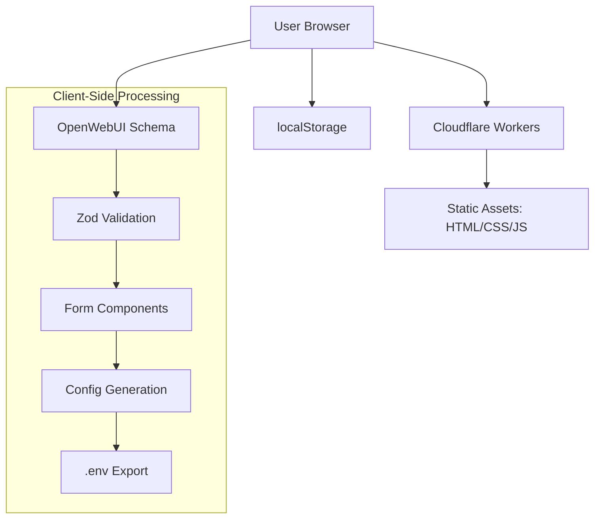

# Technical Architecture: OpenWebUI Config Tool

## Architecture Overview

The OpenWebUI Config Tool is a client-side single-page application (SPA) served via Cloudflare Workers. All processing, validation, and persistence happens in the browser.



## Existing Assets Available for Reuse

### 1. Schema Processing Pipeline
**Location**: `scripts/`
- `openapi-to-zod/` - Convert OpenAPI to Zod schemas
- `extract-uiSchema/` - Extract UI metadata  
- `generate-component-mapping/` - Map to form components

### 2. Form Components
**Location**: `src/components/`
- Existing form field components ready for integration
- shadcn/ui base components available

### 3. Configuration Schema
**Location**: `schemas/openwebui-config-schema.json`
- Complete OpenWebUI environment variable definitions

## Core Requirements

### Dual Mode Interface
The application must support two modes:
1. **Form Mode**: Visual interface with categorized form fields
2. **Raw Mode**: HTML textarea for direct `.env` file editing

### Mode Toggle Functionality
- Switch between form and raw modes
- Bidirectional data synchronization 
- Preserve user edits during mode switching

### Import Capabilities
- File upload (drag & drop support)
- Paste from clipboard
- Auto-detect ENV format

### Export Functionality  
- Download as `.env` file
- Copy to clipboard option

### Client-Side Storage
- Use localStorage for persistence
- Auto-save functionality
- Restore state on page reload

## Missing Components to Build

### Form Field Types Needed
- `NumberField` - For numeric inputs
- `IntegerField` - For integer-only inputs  
- `ObjectField` - For nested objects
- `DateField` - For date inputs

### Application Components to Create
- Main application wrapper
- Mode toggle interface
- Import/export controls
- Raw text editor using HTML textarea
- Configuration validator
- File download handler

## Data Flow Requirements

### Form to Raw Mode
- Convert form data to `.env` format
- Maintain field comments and structure
- Handle validation errors during conversion

### Raw to Form Mode  
- Parse `.env` format into structured data
- Map to appropriate form fields
- Display parsing errors if format invalid

### Import Process
- Detect file format (ENV)
- Parse content into application state
- Merge with existing configuration if needed
- Validate imported data

### Export Process
- Generate `.env` format from current state
- Include appropriate comments and structure
- Trigger browser download
- Provide clipboard copy option

## Validation Requirements

### Client-Side Validation
- Real-time validation during form input
- Schema-based validation using Zod
- Cross-field dependency validation
- Error display with helpful messages

### Export Validation
- Final validation before `.env` generation
- Ensure all required fields present
- Check format compatibility with OpenWebUI

## Browser Storage Schema

### localStorage Structure
```typescript
interface ConfigToolStorage {
  currentConfig: Record<string, any>;    // Current configuration state
  recentConfigs: SavedConfig[];          // Recently used configurations
  userPreferences: {
    mode: 'form' | 'raw';               // Current display mode
    autoSave: boolean;                   // Auto-save preference
  };
}
```

## Cloudflare Workers Deployment

### Static File Serving
The Worker serves the SPA and static assets with appropriate headers and routing.

### No Backend APIs Required
- All processing happens client-side
- No server-side validation or storage
- No authentication endpoints
- No external API integrations

## Performance Considerations

### Bundle Optimization
- Tree shake unused schema definitions
- Minimize CSS/JS bundle size
- Lazy load non-essential components

### Runtime Performance
- Debounce validation to avoid excessive processing
- Cache expensive operations
- Efficient localStorage usage

## Browser Requirements

### Target Compatibility
- Modern browsers supporting ES2020
- localStorage API support
- File API for import/export
- Standard form APIs

### Required Browser Features
- localStorage for persistence
- File download via blob URLs
- Clipboard API for copy functionality
- Drag and drop for file uploads

## Deployment Model

### Cloudflare Workers Only
- No local development environment
- Direct deployment to Cloudflare Workers
- Testing and iteration happen on deployed version
- Static asset optimization handled by Workers platform
